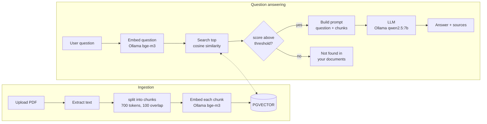
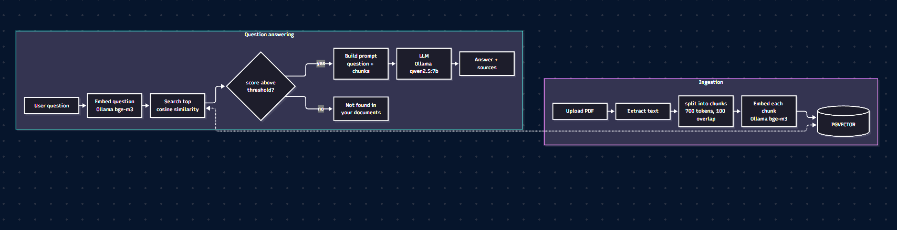

# rag-doc-qa

Ask questions about your PDF document and get answers with sources, using RAG(Retrieval-Augmented Generation).

# Architecture

```mermaid
flowchart LR
    subgraph Ingestion
        U[Upload PDF] --> X[Extract text]
        X --> C[split into chunks<br/>700 tokens, 100 overlap]
        C --> E[Embed each chunk<br/>Ollama bge-m3]
        E --> DB[(PGVECTOR)]
    end

    subgraph QA[Question answering]
        Q[User question] --> QE[Embed question<br/>Ollama bge-m3]
        QE --> S[Search top<br/>cosine similarity]
        S --> T{score above<br/>threshold?}
        T -->|yes| P[Build prompt<br/>question + chunks]
        P --> L[LLM<br/>Ollama qwen2.5:7b]
        L --> A[Answer + sources]
        T --> |no| N[Not found in<br/>your documents]
    end

    S <-.-> DB
```

